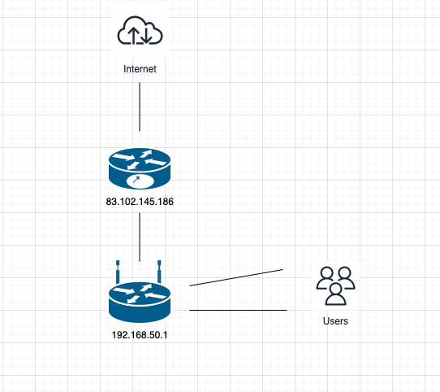

# Домашнее задание к занятию «Компьютерные сети. Лекция 3»

1. Подключитесь к публичному маршрутизатору в интернет. Найдите маршрут к вашему публичному IP.

```
route-views>show ip route 89.178.5.225
Routing entry for 89.178.0.0/15
  Known via "bgp 6447", distance 20, metric 0
  Tag 3356, type external
  Last update from 4.68.4.46 22:40:28 ago
  Routing Descriptor Blocks:
  * 4.68.4.46, from 4.68.4.46, 22:40:28 ago
      Route metric is 0, traffic share count is 1
      AS Hops 2
      Route tag 3356
      MPLS label: none

route-views>show bgp 89.178.5.225
BGP routing table entry for 89.178.0.0/15, version 2747565423
Paths: (20 available, best #1, table default)
  Not advertised to any peer
  Refresh Epoch 1
  3356 8402
    4.68.4.46 from 4.68.4.46 (4.69.184.201)
      Origin IGP, metric 0, localpref 100, valid, external, best
      Community: 3356:2 3356:22 3356:100 3356:123 3356:501 3356:903 3356:2065 8402:900 8402:904 8402:905
      path 7FE05564D608 RPKI State not found
      rx pathid: 0, tx pathid: 0x0
  Refresh Epoch 1
  6939 3356 8402
    64.71.137.241 from 64.71.137.241 (216.218.253.53)
      Origin IGP, localpref 100, valid, external
      path 7FE0E012B6A8 RPKI State not found
      rx pathid: 0, tx pathid: 0
  Refresh Epoch 1
  7018 3356 8402
    12.0.1.63 from 12.0.1.63 (12.0.1.63)
      Origin IGP, localpref 100, valid, external
      Community: 7018:5000 7018:37232
      path 7FE15CDE5968 RPKI State not found
      rx pathid: 0, tx pathid: 0
  Refresh Epoch 1
  3267 3216 8402
    194.85.40.15 from 194.85.40.15 (185.141.126.1)
      Origin IGP, metric 0, localpref 100, valid, external
      path 7FE1CC0B1F08 RPKI State not found
      rx pathid: 0, tx pathid: 0
  Refresh Epoch 1
  49788 12552 3216 8402
    91.218.184.60 from 91.218.184.60 (91.218.184.60)
      Origin IGP, localpref 100, valid, external
      Community: 12552:12000 12552:12100 12552:12101 12552:22000
      Extended Community: 0x43:100:1
      path 7FE0C663EBC0 RPKI State not found
      rx pathid: 0, tx pathid: 0
  Refresh Epoch 1
  20912 3257 3356 8402
    212.66.96.126 from 212.66.96.126 (212.66.96.126)
      Origin IGP, localpref 100, valid, external
      Community: 3257:8067 3257:30515 3257:50001 3257:53900 3257:53902 20912:65004
      path 7FE03E8C2A10 RPKI State not found
      rx pathid: 0, tx pathid: 0
  Refresh Epoch 1
  3549 3356 8402
    208.51.134.254 from 208.51.134.254 (67.16.168.191)
      Origin IGP, metric 0, localpref 100, valid, external
      Community: 3356:2 3356:22 3356:100 3356:123 3356:501 3356:903 3356:2065 3549:2581 3549:30840 8402:900 8402:904 8402:905
      path 7FE178843D80 RPKI State not found
      rx pathid: 0, tx pathid: 0
  Refresh Epoch 1
  101 3356 8402
    209.124.176.223 from 209.124.176.223 (209.124.176.223)
      Origin IGP, localpref 100, valid, external
      Community: 101:20100 101:20110 101:22100 3356:2 3356:22 3356:100 3356:123 3356:501 3356:903 3356:2065 8402:900 8402:904 8402:905
      Extended Community: RT:101:22100
      path 7FE103ADA3A0 RPKI State not found
      rx pathid: 0, tx pathid: 0
  Refresh Epoch 1
  852 3356 8402
    154.11.12.212 from 154.11.12.212 (96.1.209.43)
      Origin IGP, metric 0, localpref 100, valid, external
      path 7FE134AF8ED0 RPKI State not found
      rx pathid: 0, tx pathid: 0
  Refresh Epoch 1
  20130 6939 3356 8402
    140.192.8.16 from 140.192.8.16 (140.192.8.16)
      Origin IGP, localpref 100, valid, external
      path 7FE17F245DC8 RPKI State not found
      rx pathid: 0, tx pathid: 0
  Refresh Epoch 1
  57866 3356 8402
    37.139.139.17 from 37.139.139.17 (37.139.139.17)
      Origin IGP, metric 0, localpref 100, valid, external
      Community: 3356:2 3356:22 3356:100 3356:123 3356:501 3356:903 3356:2065 8402:900 8402:904 8402:905 57866:100 65100:3356 65103:1 65104:31
      unknown transitive attribute: flag 0xE0 type 0x20 length 0x30
        value 0000 E20A 0000 0064 0000 0D1C 0000 E20A
              0000 0065 0000 0064 0000 E20A 0000 0067
              0000 0001 0000 E20A 0000 0068 0000 001F
              
      path 7FE164E19010 RPKI State not found
      rx pathid: 0, tx pathid: 0
  Refresh Epoch 1
  1351 6939 3356 8402
    132.198.255.253 from 132.198.255.253 (132.198.255.253)
      Origin IGP, localpref 100, valid, external
      path 7FE1260E2510 RPKI State not found
      rx pathid: 0, tx pathid: 0
  Refresh Epoch 1
  3333 6762 8402
    193.0.0.56 from 193.0.0.56 (193.0.0.56)
      Origin IGP, localpref 100, valid, external
      Community: 6762:1 6762:92 6762:14900
      path 7FE13CED4400 RPKI State not found
      rx pathid: 0, tx pathid: 0
  Refresh Epoch 1
  3257 3356 8402
    89.149.178.10 from 89.149.178.10 (213.200.83.26)
      Origin IGP, metric 10, localpref 100, valid, external
      Community: 3257:8794 3257:30043 3257:50001 3257:54900 3257:54901
      path 7FE0E31F5AA8 RPKI State not found
      rx pathid: 0, tx pathid: 0
  Refresh Epoch 1
  3561 3910 3356 8402
    206.24.210.80 from 206.24.210.80 (206.24.210.80)
      Origin IGP, localpref 100, valid, external
      path 7FE000E6C250 RPKI State not found
      rx pathid: 0, tx pathid: 0
  Refresh Epoch 1
  2497 3356 8402
    202.232.0.2 from 202.232.0.2 (58.138.96.254)
      Origin IGP, localpref 100, valid, external
      path 7FE1088FFE40 RPKI State not found
      rx pathid: 0, tx pathid: 0
  Refresh Epoch 1
  8283 57866 3356 8402
    94.142.247.3 from 94.142.247.3 (94.142.247.3)
      Origin IGP, metric 0, localpref 100, valid, external
      Community: 3356:2 3356:22 3356:100 3356:123 3356:501 3356:903 3356:2065 8283:15 8402:900 8402:904 8402:905 57866:100 65100:3356 65103:1 65104:31
      unknown transitive attribute: flag 0xE0 type 0x20 length 0x3C
        value 0000 205B 0000 0006 0000 000F 0000 E20A
              0000 0064 0000 0D1C 0000 E20A 0000 0065
              0000 0064 0000 E20A 0000 0067 0000 0001
              0000 E20A 0000 0068 0000 001F 
      path 7FE12D008308 RPKI State not found
      rx pathid: 0, tx pathid: 0
  Refresh Epoch 1
  19214 3257 3356 8402
    208.74.64.40 from 208.74.64.40 (208.74.64.40)
      Origin IGP, localpref 100, valid, external
      Community: 3257:8108 3257:30048 3257:50002 3257:51200 3257:51203
      path 7FE1240D7EE8 RPKI State not found
      rx pathid: 0, tx pathid: 0
  Refresh Epoch 1
  4901 6079 3356 8402
    162.250.137.254 from 162.250.137.254 (162.250.137.254)
      Origin IGP, localpref 100, valid, external
      Community: 65000:10100 65000:10300 65000:10400
      path 7FE0FEF6AF48 RPKI State not found
      rx pathid: 0, tx pathid: 0
  Refresh Epoch 1
  3303 3356 8402
    217.192.89.50 from 217.192.89.50 (138.187.128.158)
      Origin IGP, localpref 100, valid, external
      Community: 3303:1004 3303:1006 3303:3052 3356:2 3356:22 3356:100 3356:123 3356:501 3356:903 3356:2065 3356:10725 8402:900 8402:904 8402:905
      path 7FE048A46548 RPKI State not found
      rx pathid: 0, tx pathid: 0

```

2. Создайте dummy-интерфейс в Ubuntu. Добавьте несколько статических маршрутов. Проверьте таблицу маршрутизации.

```
sudo nano /etc/network/interfaces

auto dummy0
iface dummy0 inet static
address 10.0.0.1/32
pre-up ip link add dummy0 type dummy
post-down ip link del dummy0


sudo service networking restart

ip link

1: lo: <LOOPBACK,UP,LOWER_UP> mtu 65536 qdisc noqueue state UNKNOWN mode DEFAULT group default qlen 1000
    link/loopback 00:00:00:00:00:00 brd 00:00:00:00:00:00
2: primary: <BROADCAST,MULTICAST,UP,LOWER_UP> mtu 1500 qdisc fq_codel state UP mode DEFAULT group default qlen 1000
    link/ether 00:25:90:a7:87:a6 brd ff:ff:ff:ff:ff:ff
3: enp3s0: <BROADCAST,MULTICAST> mtu 1500 qdisc noop state DOWN mode DEFAULT group default qlen 1000
    link/ether 00:25:90:a7:87:a7 brd ff:ff:ff:ff:ff:ff
4: enp4s0: <BROADCAST,MULTICAST> mtu 1500 qdisc noop state DOWN mode DEFAULT group default qlen 1000
    link/ether 00:25:90:a7:87:a8 brd ff:ff:ff:ff:ff:ff
5: enp5s0: <BROADCAST,MULTICAST> mtu 1500 qdisc noop state DOWN mode DEFAULT group default qlen 1000
    link/ether 00:25:90:a7:87:a9 brd ff:ff:ff:ff:ff:ff
6: tun0: <POINTOPOINT,MULTICAST,NOARP,UP,LOWER_UP> mtu 1500 qdisc fq_codel state UNKNOWN mode DEFAULT group default qlen 100
    link/none 
7: dummy0: <BROADCAST,NOARP,UP,LOWER_UP> mtu 1500 qdisc noqueue state UNKNOWN mode DEFAULT group default qlen 1000
    link/ether d2:ef:32:3a:49:ed brd ff:ff:ff:ff:ff:ff

sudo ip route add 192.168.30.0/24 via 74.201.72.49

default via 74.201.72.49 dev primary proto static 
10.8.0.0/24 via 10.8.0.2 dev tun0 
10.8.0.2 dev tun0 proto kernel scope link src 10.8.0.1 
74.201.72.48/29 dev primary proto kernel scope link src 74.201.72.50 
192.168.30.0/24 via 74.201.72.49 dev primary 
```

3. Проверьте открытые TCP-порты в Ubuntu. Какие протоколы и приложения используют эти порты? Приведите несколько примеров.

```
vagrant@vagrant:~$ sudo ss -ltpn
State       Recv-Q      Send-Q           Local Address:Port             Peer Address:Port      Process                                         
LISTEN      0           4096             127.0.0.53%lo:53                    0.0.0.0:*          users:(("systemd-resolve",pid=662,fd=13))      
LISTEN      0           128                    0.0.0.0:22                    0.0.0.0:*          users:(("sshd",pid=741,fd=3))                  
LISTEN      0           128                       [::]:22                       [::]:*          users:(("sshd",pid=741,fd=4))    
```

порт 22 - ssh, порт 53 - dns

4. Проверьте используемые UDP-сокеты в Ubuntu. Какие протоколы и приложения используют эти порты?

```
vagrant@vagrant:~$ sudo ss -lupn
State       Recv-Q      Send-Q            Local Address:Port            Peer Address:Port      Process                                         
UNCONN      0           0                 127.0.0.53%lo:53                   0.0.0.0:*          users:(("systemd-resolve",pid=662,fd=12))      
UNCONN      0           0                10.0.2.15%eth0:68                   0.0.0.0:*          users:(("systemd-network",pid=660,fd=19))
```

5. Используя diagrams.net, создайте L3 диаграмму вашей домашней сети или любой другой сети, с которой вы работали.

